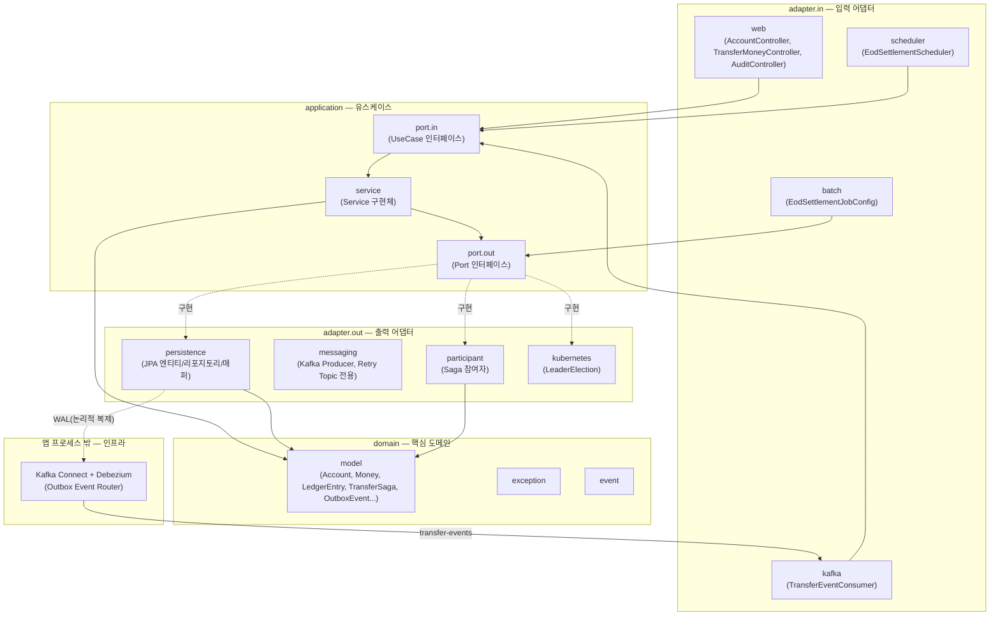

# FBRL (Financial Backend Reliability Lab)

금융 거래의 **신뢰성**, **분산 동시성 제어**, **장애 복구 메커니즘**을 직접 구현하고 검증하기 위한 백엔드 실험 플랫폼입니다. 실제 서비스가 아니라, 분산 락·Saga·EOD 배치·Kafka 재시도/CDC 기반 이벤트 발행 등 금융 백엔드에서 요구되는 신뢰성 패턴을 헥사고날 아키텍처 위에서 검증하는 것이 목적입니다.

## 기술 스택

| 구분 | 기술 |
|---|---|
| Language | Java 17 |
| Framework | Spring Boot 4.0.7 |
| Architecture | 헥사고날 아키텍처 (Ports & Adapters) |
| Database | PostgreSQL 16 (wal_level=logical) |
| Cache / 분산 락 | Redis 7.2, Redisson |
| Messaging | Apache Kafka 3.9.0 (KRaft) |
| CDC | Debezium 3.0.0.Final + Kafka Connect (PostgreSQL 논리적 복제 기반 Outbox Event Router) |
| Batch | Spring Batch 6.0.4 |
| 분산 스케줄링 | ShedLock 7.7.0, Kubernetes Lease API (client-java 27.0.0) |
| Build | Gradle |

## 아키텍처

의존성은 항상 바깥(adapter)에서 안쪽(domain)으로만 흐릅니다. domain은 프레임워크에 의존하지 않습니다.



## 3개 트랙별 핵심 기능

### 트랙 1 — 실시간 트랜잭션 & 분산 동시성 제어
- Redisson 분산 락 (`@DistributedLock` AOP, REQUIRES_NEW 트랜잭션 분리)
- API 멱등성 (Redis SETNX 기반 `@CheckIdempotency`)
- Transactional Outbox 패턴 + Debezium CDC 기반 발행 (PostgreSQL 논리적 복제, 폴링 없이 WAL 기반으로 실시간에 가깝게 Kafka 발행)
- 해시체인 기반 불변 감사로그 (`OutboxEvent`가 직전 항목의 SHA-256 해시를 포함, `outbox_chain_tail` 단일 행 `SELECT ... FOR UPDATE`로 동시 삽입 시 체인 분기 방지, `GET /api/v1/audit/verify`로 전체 체인 무결성 검증)
- Saga 오케스트레이션 (`TransferSaga` 상태 머신 + 보상 트랜잭션, Choreography 대신 Orchestration 채택)
- 복식부기 원장(`LedgerEntry`, append-only) — 계좌 잔액을 저장 필드가 아닌 원장 합산 파생값(SSOT)으로 전환, 거래 단위 대차평형은 `LedgerEntry.transferPair`로 구조적 보장

### 트랙 2 — EOD 대규모 정산 배치
- Spring Batch 6.0.4 Chunk-oriented EOD 정산 Job (계좌별 일할 이자 계산 및 마감 스냅샷 저장)
- ShedLock 기반 다중 인스턴스 스케줄러 중복 실행 방지
- Kubernetes Lease API 기반 리더 선출 연동 (`k8s.leader-election.enabled` 플래그, 기본 비활성화 — kind/kubeconfig 없는 환경에서도 기존 테스트가 깨지지 않도록 조건부 활성화)
- 시스템 전체 대차평형(trial balance) 검증 배치 스텝 — 매일 EOD 마감 시 전체 `LedgerEntry` 차변/대변 합을 대조해 불일치 시 배치 실패로 알림

### 트랙 3 — 장애 복구 & 복원력
- Kafka Consumer Non-blocking Retry Topic + DLT (결정론적 실패는 즉시 DLT로, 일시적 실패는 지수 백오프 재시도)
- Chaos Mesh 기반 결함 주입은 **Infra 담당(김준희) 영역**이며 이 리포지토리의 범위 밖입니다. 백엔드는 "어떤 장애 시나리오로 무엇을 검증할지" 정의와 장애 주입 후 애플리케이션 반응 검증을 담당합니다.

## 로컬 실행 방법

의존 인프라(PostgreSQL, Redis, Kafka, Kafka Connect)는 `docker-compose.yml`로 기동합니다. Debezium 커넥터는 Kafka Connect REST API로 별도 등록해야 합니다.

```bash
docker compose up -d
curl -X POST -H "Content-Type: application/json" \
  --data @debezium/outbox-connector.json \
  http://localhost:8083/connectors
./gradlew bootRun
```

- 계좌 개설/조회, 이체 API는 `localhost:8080`에서 확인할 수 있습니다.
- 감사로그 체인 무결성은 `GET /api/v1/audit/verify`로 확인할 수 있습니다 (`{"valid":true,"totalEntries":N}`, 변조 시 `brokenAtId`/`reason` 포함).
- EOD 정산 배치는 기본적으로 자동 실행되지 않습니다 (`spring.batch.job.enabled: false`) — 파드 재시작 시 중복 실행을 방지하기 위함이며, `EodSettlementScheduler`의 cron 설정(`eod.batch.cron`)을 통해 트리거됩니다.
- Kubernetes Lease 리더 선출 검증은 kind 등 로컬 클러스터와 `k8s/rbac/` 매니페스트 적용이 별도로 필요하며, 기본값은 비활성화(`k8s.leader-election.enabled: false`)되어 있습니다.
- 실제 접속 정보(DB/Redis 계정 등)는 `src/main/resources/application.yaml` 및 `docker-compose.yml`을 직접 참고하세요. 이 문서에는 시크릿 값을 기재하지 않습니다.

## 팀 구성 및 역할 분담

| 이름 | 역할 | 담당 업무 |
|---|---|---|
| 김주영 | Backend | 실시간 거래 파이프라인, Saga 오케스트레이션, Redisson 분산 락, Spring Batch 엔진 |
| 김준희 | Infra / SRE | Kubernetes 클러스터, ArgoCD GitOps, Prometheus/Grafana 관측성, **Chaos Mesh 결함 주입** |

## 더 알아보기

- 아키텍처 상세 설명 및 기술적 의사결정 근거: [`ARCHITECTURE.md`](./ARCHITECTURE.md)
- 전체 작업 이력/트러블슈팅 기록: [`PROGRESS.md`](./PROGRESS.md)
- AI 에이전트 작업 가드레일: [`CLAUDE.md`](./CLAUDE.md)
